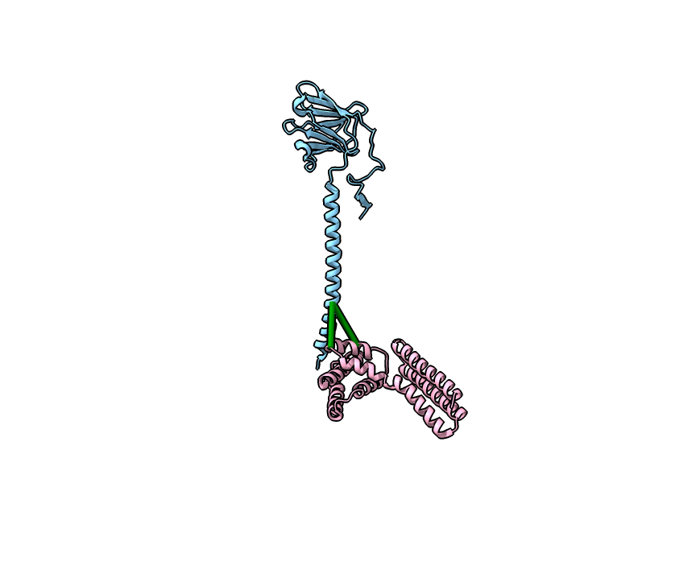
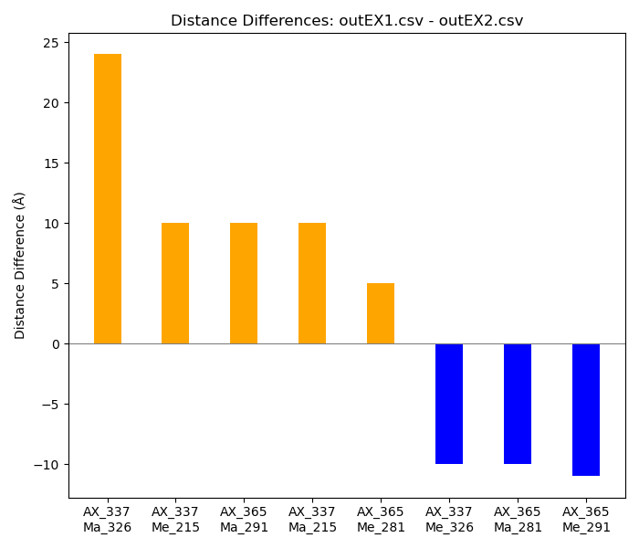
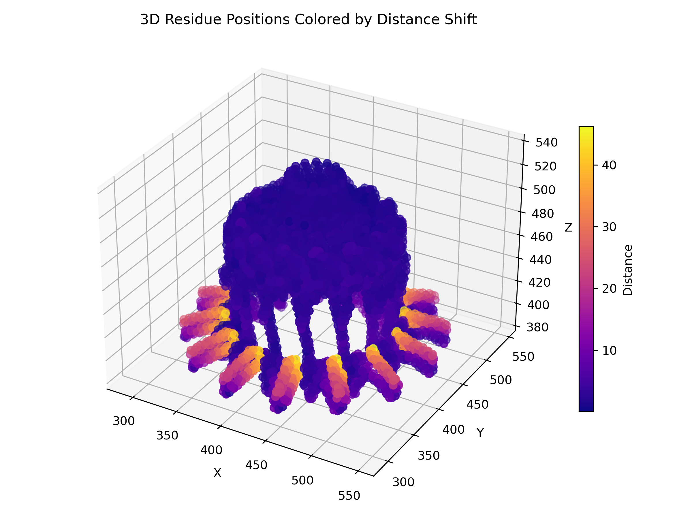
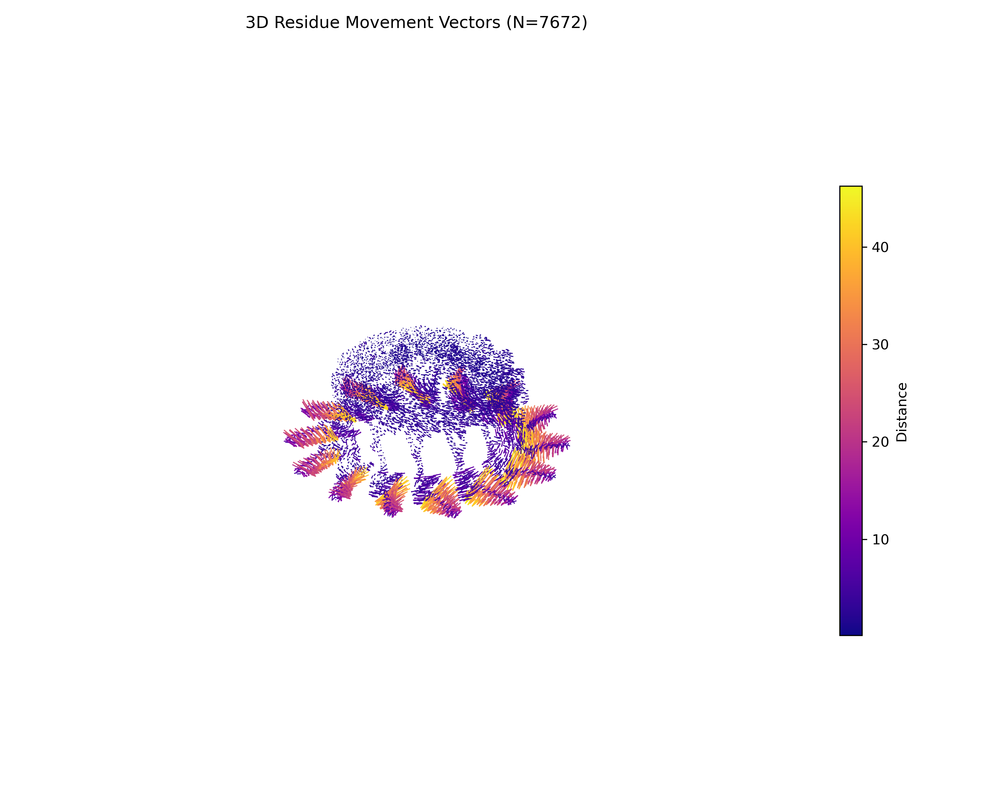
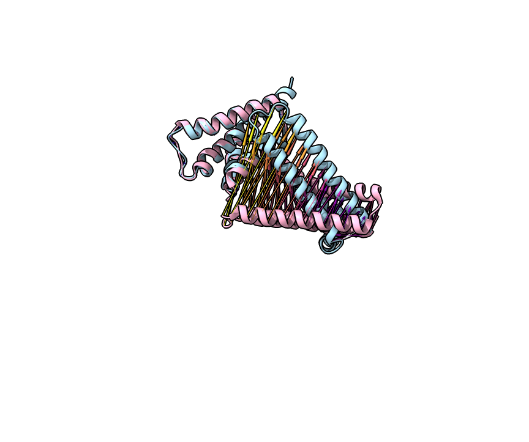

# ResiRuler

ResiRuler is a command-line tool and upcoming web interface for analyzing and visualizing residue-level structural changes in biomolecular models. It supports measuring distances between annotated residues, comparing distances across aligned conformations, and visualizing movement vectors with options to visualize in ChimeraX

---

## Features

- Extracts and compares residue distances from `.cif` structures
- Computes movement vectors between aligned conformations
- Generates ChimeraX scripts for structural visualization
- Plots difference and shift metrics

---

## Installation

Clone the repository and install the required dependencies:

```bash
git clone https://github.com/tbaker67/ResiRuler.git
cd ResiRuler
pip install -r requirements.txt
```

---

## Command-Line Usage

### `run`: Distance Extraction Mode

Generate pairwise distances between specified residues in an Excel sheet.

```bash
python resiruler.py run \
  -i input.xlsx \
  -s structure.cif \
  -o output.csv \
  -c config.yaml \
  -v
```

**Arguments**:
- `--input`: Excel sheet of residue pairs
- `--structure`: Path to the structure `.cif` file
- `--output`: Output CSV file for distances
- `--config`: YAML with chain mappings
- `--visualize`: Optionally generate ChimeraX link script

**Example Visualization**:



---

### `compare`: Distance Difference Mode

Compare two CSV outputs to measure how distances between specified residues change in different conformations.

```bash
python resiruler.py compare output1.csv output2.csv --plot-out diff_plot.png
```

**Arguments**:
- `csv1`: First results CSV
- `csv2`: Second results CSV
- `--plot-out`: Output image path

**Example Visualization**:



---

### `movement`: Movement Vector Mode

Calculate how each residue moves between two aligned conformations.

You can use any preferred alignment method, however a quick and easy method is to simply load the structures into ChimeraX, and use their built in matchmaker tools to align the structures.

```bash
python resiruler.py movement aligned1.cif aligned2.cif \
  -c chain_map.yaml \
  --plot-out movement_plot.png \
  --csv-out movement_data.csv
```

**Arguments**:
- `aligned_cif1`: First aligned `.cif` file
- `aligned_cif2`: Second aligned `.cif` file
- `--chain_mapping`: YAML file mapping chains across models
- `--csv-out`: Output CSV with per-residue shifts
- `--plot-out`: Output image for visualization

**Example Visualizations**:








---

## Configuration

Example `config.yaml`:

```yaml
chain_mapping:
  Protein A: A
  BM: XM
color_thresholds:
  green: 20
  yellow: 33
```

---

## Dependencies

- Python ≥ 3.8
- Biopython
- pandas
- matplotlib
- PyYAML

---


## License

MIT License

---

## Author

Timothy Baker
