# ResiRuler

ResiRuler is a web interface based tool for analyzing and visualizing residue-level structural changes in biomolecular models. It supports measuring distances between annotated residues, comparing distances across aligned conformations, and visualizing movement vectors with options to visualize in ChimeraX

---

## Features

- Extracts and compares residue distances from `.cif` structures
- Computes movement vectors between aligned conformations
- Generates ChimeraX scripts for structural visualization
- Plots difference and shift metrics as well as contat maps
- Aligns two models using the mmalign algorithm and cleans up non-matched residues

---

## Installation

Clone the repository and install the required dependencies:
ResiRuler dependencies are most easily downloaded using [conda](https://www.anaconda.com/docs/getting-started/getting-started)

Once conda is up and running here is how you can install resiruler as well as the associated dependencies

```bash
git clone https://github.com/tbaker67/ResiRuler.git
cd ResiRuler
conda create env create -f environemt.yml
conda activate resiruler
```

## Running the UI

ResiRuler's web interface is current managed through streamlit

First make sure to activate the conda environment
```bash
conda activate resiruler
```
Then use the streamlit command to launch the UI
```bash
streamlit streamlit run ResidueRuler/ui_components/ui.py
```
A successful launch will provide this message in the terminal. Using the network url will allow others to access an independent instance of the Web Interface as long as they are connected to the same network as the deivce you launched from


## The "Run" Tab

The "Run" tab is designed for use of a single cif structure file

After uploading a CIF file, you can specify what chains in your structure you'd like to actually calculate distances for by simply selecting them from the dropdown menu. Do note that for very larger structures you will likely want to select a subset of chains and/or adjust the upper and lower thresholds, as otherwise it may be too computationally intensive for less powerful machines.


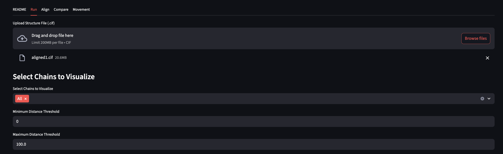

After hitting "Run" a contact map as well as a table of all inter-residue distances will be calculated 

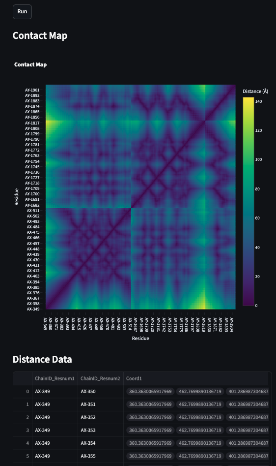

You'll then be able to specify residue pairings as well as distance color thresholds for the link visualization

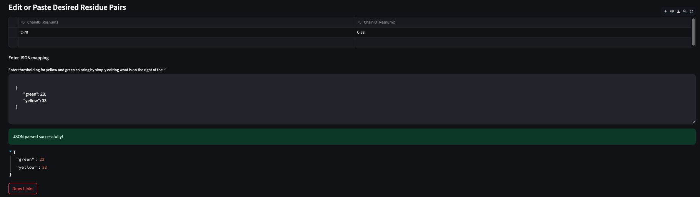

And will get a Pymol Visualization Preview, Distance table for selected pairs, and a script which will draw the links in chimeraX

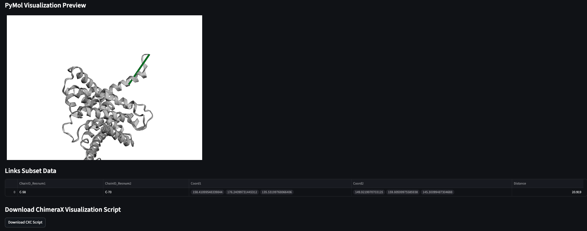

**Example ChimeraX Visualization**:

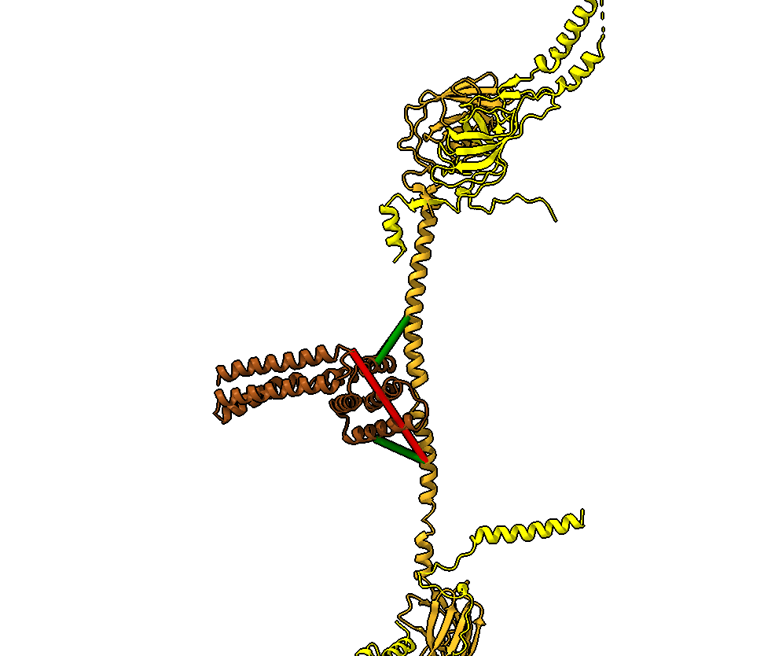

---

## 'The Align Tab'

The "Align" tab allows for the alignment of any two genetically similar molecules. It performs alignment using [USalign's](https://www.nature.com/articles/s41592-022-01585-1) multimer alignment algorithm (MMalign)

Start by uploading files

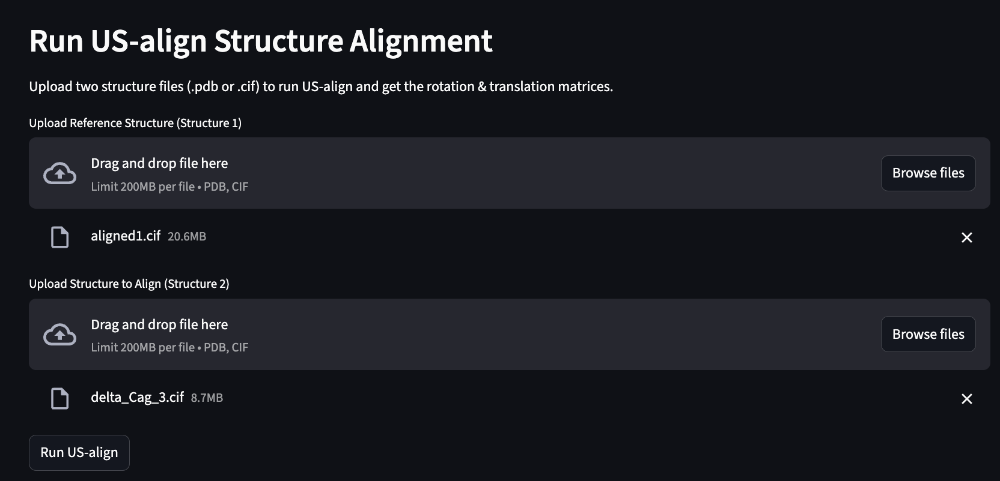

You'll get preview of the alignment


There is also an option to "clean" the alignment to get rid of unmatched chains or residues, and those CIF files can be downloaded for future use
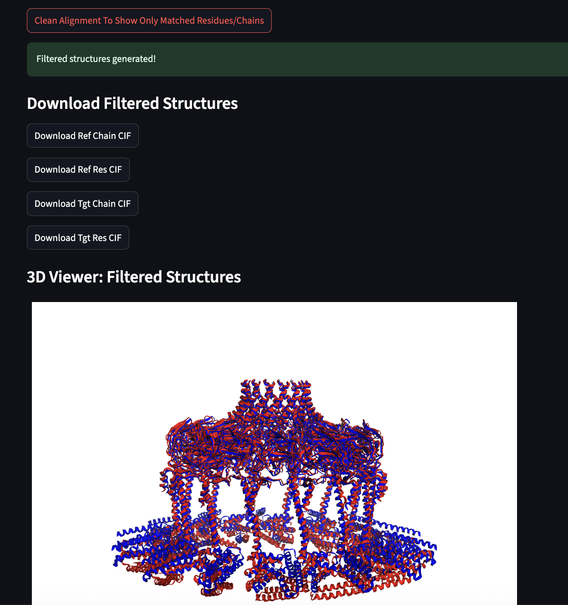


---

## 'The "Compare" Tab'

---

This tab is where you can compare inter-residue distances between (currently) two structures with multi-comparisons currently in progress

It offers auto-matching of chains between the two structures as well as the ability, to set an explicit mapping
If you use the auto-matching with multiple chains of the same sequence in each structure, it is important that you supply aligned structures either from the "Align" job, or any other alignment software of your choice

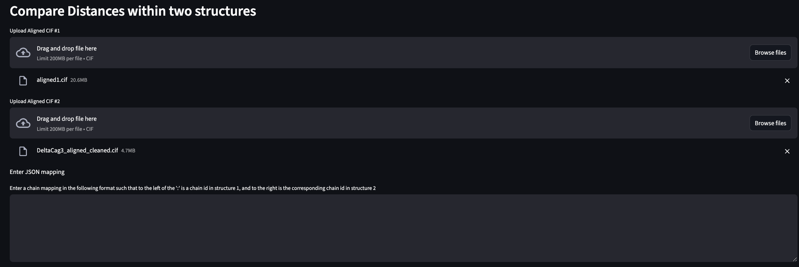

You'll have the option to specify which chains to look at, in addition to setting a minimum percent identity threshold which is used when matching chains together
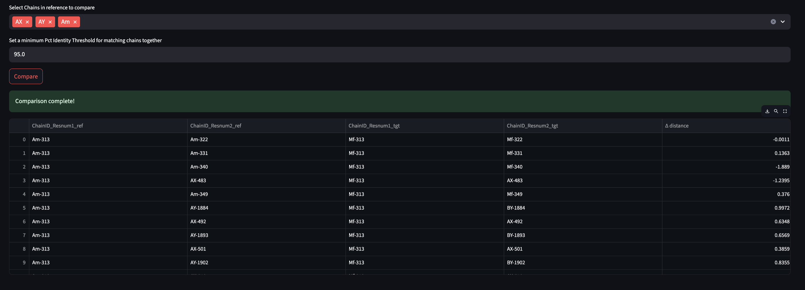

This will produce contact maps for both structures provided, as well as a distance difference map which is essentially a subtraction of the two contact maps
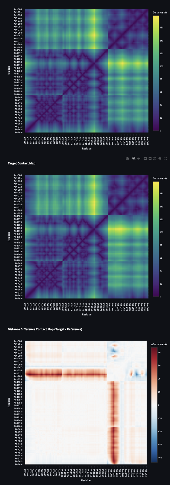


---

## 'The "Movement" Tab'

---

Calculate how each residue moves between two aligned conformations via calculting the distance between corresponding residues in the two structures, (with the ability for multiple comparisons coming soon).

Here, you must use aligned structures/models, but can choose any preffered method

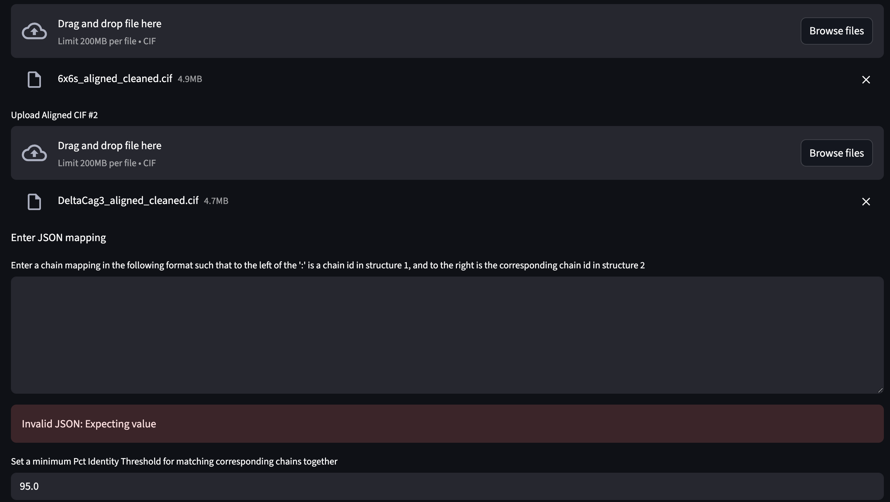

The Data Table will have the distance as well as the vector describing how each residue is moving between the two structures
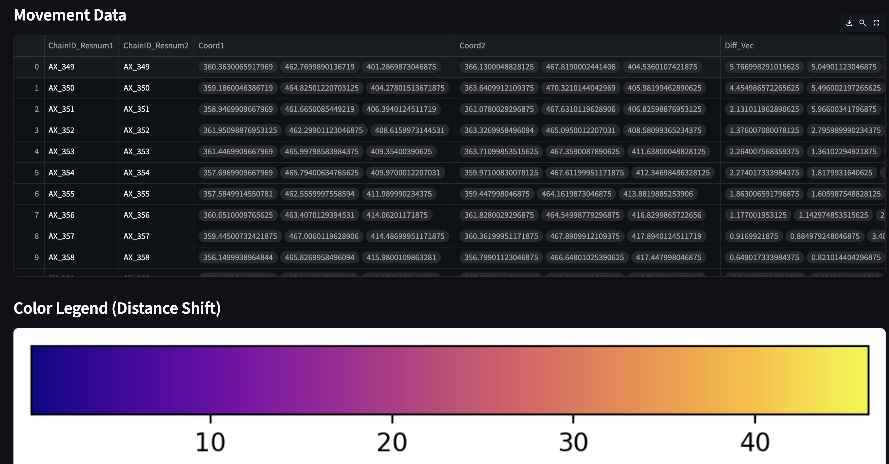

There will also be a color bar, which corresponds to the PyMol Viewer Preview Visualizations
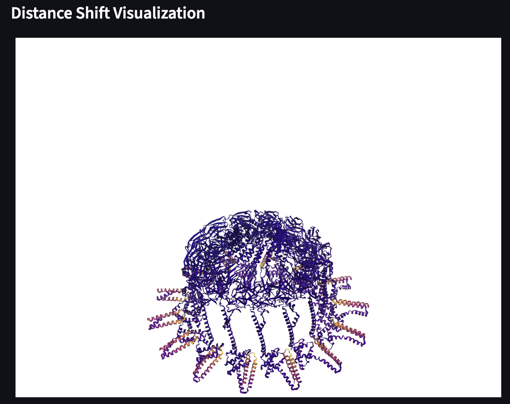

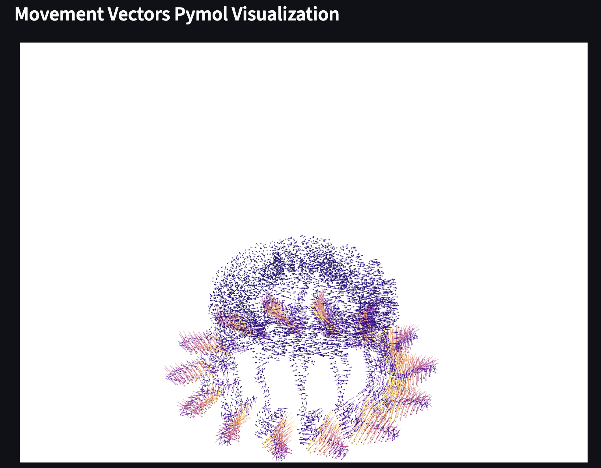

There will be an option to download a zipped folder containing these file contents
- Opening the .cxc script calls the defattr files and will color in atoms into chimeraX, where you can then adjust as you see fit
- Opening the .bild file will put the vector representation into ChimeraX
- The csv contains all the associated data
- The cif files used for this comparison

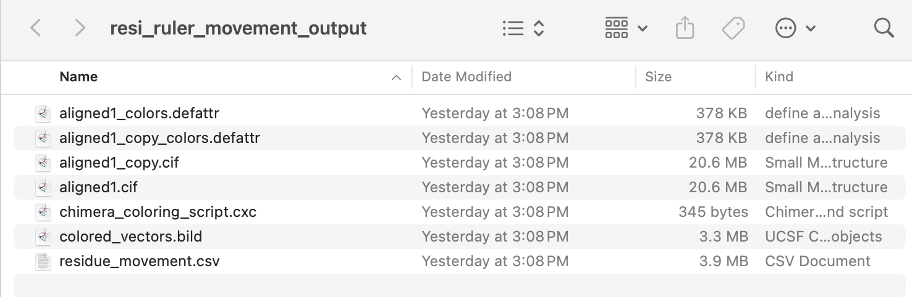

**Example Visualization**:


This can actually be recolored inside of ChimeraX, by going to tools->depiction->Render/Select by Attribute

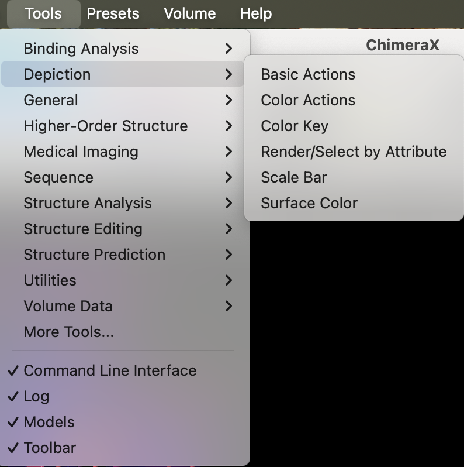

And then selecting the "distance" attribute in the window that pops up. This allow for thresholding as well as re-color by using different color palletes

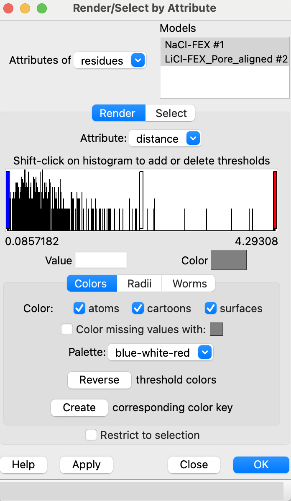


---


## License

MIT License

---

## Author

Timothy Baker
