# ResiRuler

ResiRuler is a web interface based tool for analyzing and visualizing residue-level structural changes in biomolecular models. It supports measuring distances between annotated residues, comparing distances across aligned conformations, and visualizing movement vectors with options to visualize in ChimeraX

---

## Features

- Extracts and compares residue distances from `.cif` structures
- Computes movement vectors between aligned conformations
- Generates ChimeraX scripts for structural visualization
- Plots difference and shift metrics as well as contat maps
- Aligns two models using the mmalign algorithm and cleans up non-matched residues

---

## Installation

Clone the repository and install the required dependencies:
ResiRuler dependencies are most easily downloaded using [conda](https://www.anaconda.com/docs/getting-started/getting-started)

Once conda is up and running here is how you can install resiruler as well as the associated dependencies

```bash
git clone https://github.com/tbaker67/ResiRuler.git
cd ResiRuler
conda env create -f environment.yml
conda activate resiruler
```

## Running the UI

ResiRuler's web interface is current managed through streamlit

First make sure to activate the conda environment
```bash
conda activate resiruler
```
Then use the streamlit command to launch the UI
```bash
streamlit run ResidueRuler/ui/app.py
```
A successful launch will provide this message in the terminal. Using the network url will allow others to access an independent instance of the Web Interface as long as they are connected to the same network as the deivce you launched from

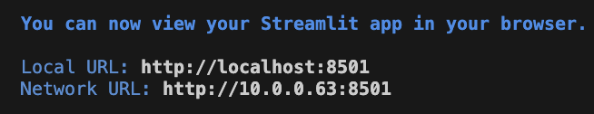


## The "Run" Tab

The "Run" tab is designed for use of a single cif structure file

After uploading a CIF file, you can specify what chains in your structure you'd like to actually calculate distances for by simply selecting them from the dropdown menu. Do note that for very larger structures you will likely want to select a subset of chains and/or adjust the upper and lower thresholds, as otherwise it may be too computationally intensive for less powerful machines.


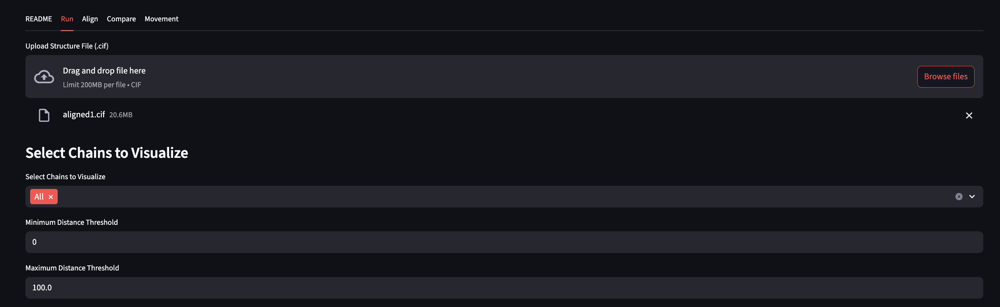

After hitting "Run," a contact map and a table of all inter-residue distances will be calculated.

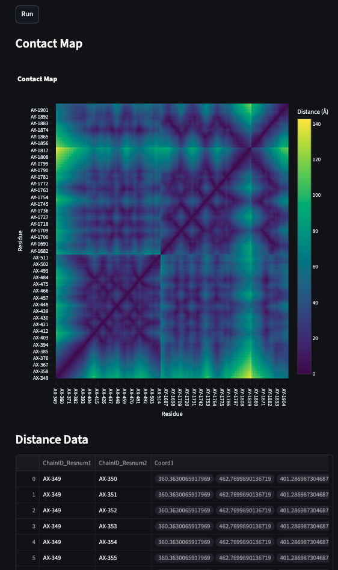

Specify residue pairings and distance color thresholds for the link visualization.

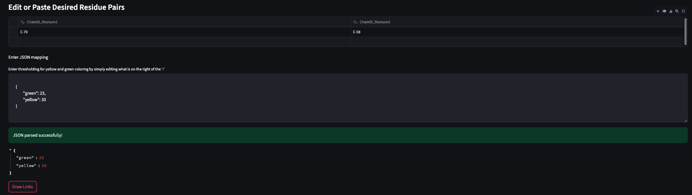

You will get a PyMol Visualization Preview, a distance table for selected pairs, and a script which will draw the links in ChimeraX.

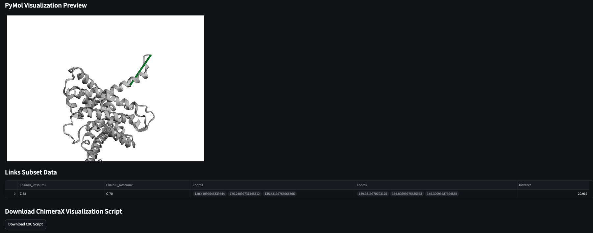

**Example ChimeraX Visualization:**

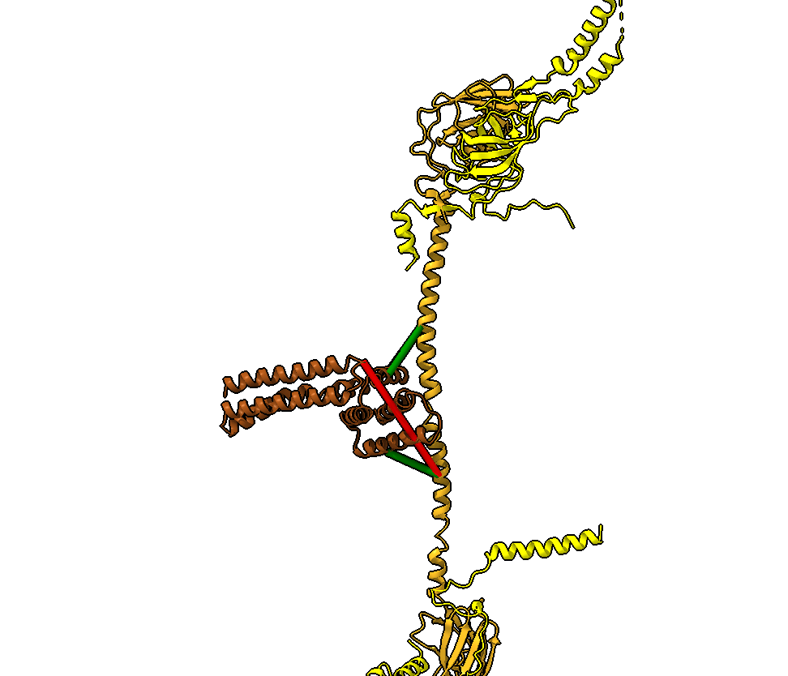

---


### The "Align" Tab

Align any two genetically similar molecules using [USalign's](https://www.nature.com/articles/s41592-022-01585-1) multimer alignment algorithm (MMalign). Use this tab before comparing or analyzing movement between structures.

Start by uploading files:

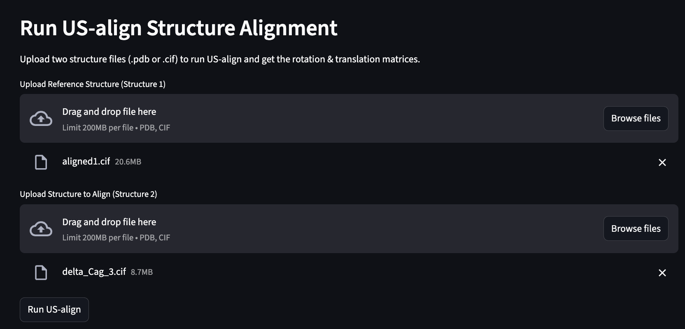

Preview the alignment:
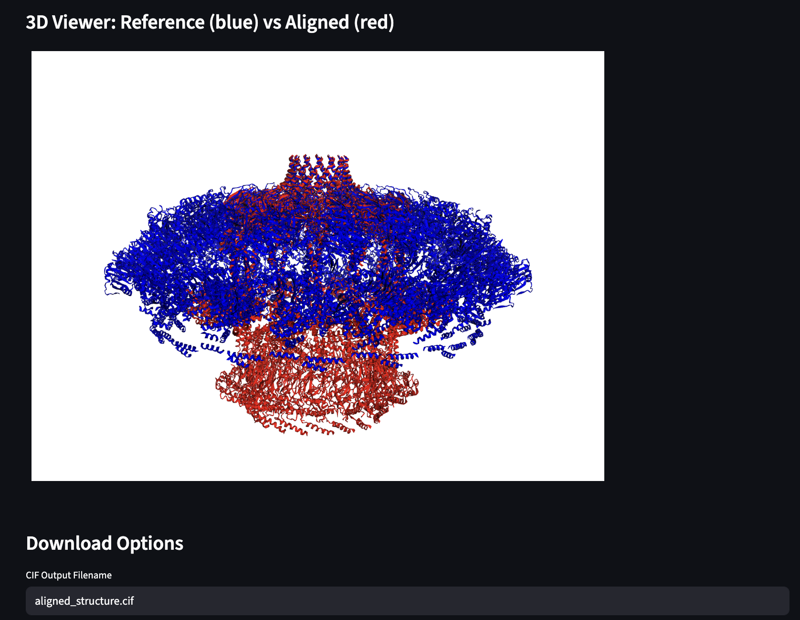

Optionally "clean" the alignment to remove unmatched chains or residues. Download cleaned CIF files for future use.
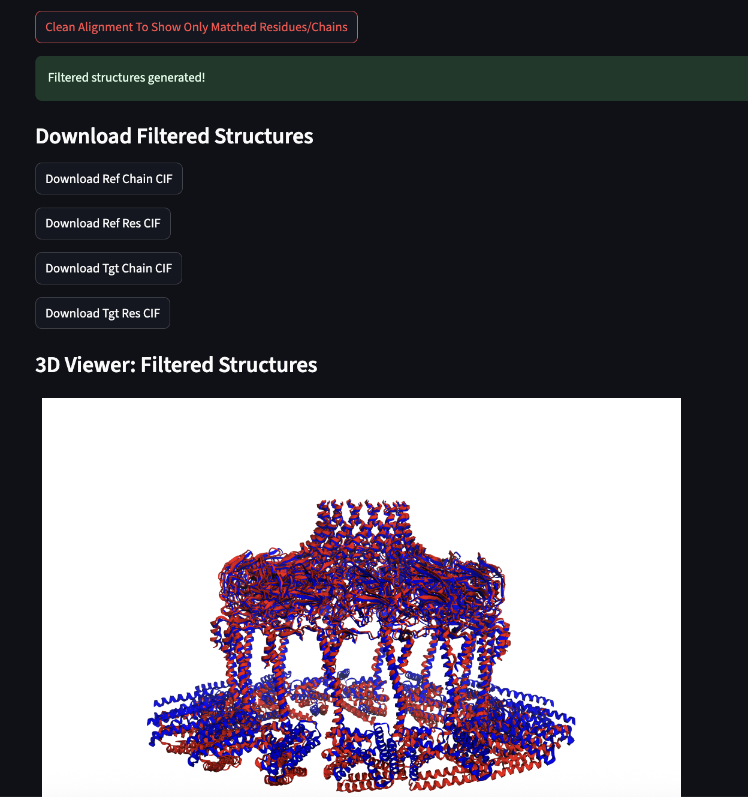

---


### The "Compare" Tab

Compare inter-residue distances between two structures. Multi-comparison support is in progress.

- Auto-matches chains between structures, or allows explicit mapping.
- For best results, supply aligned structures from the **Align** tab or other alignment software.

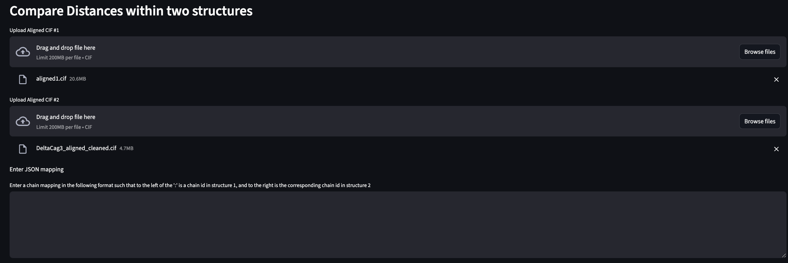

Specify which chains to compare and set a minimum percent identity threshold for chain matching.
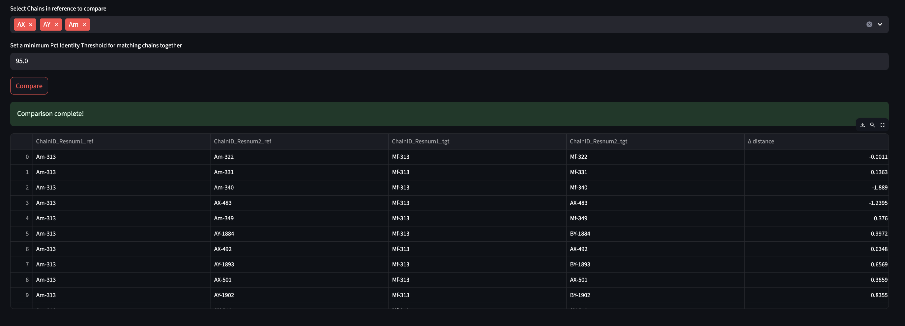

Produces contact maps for both structures and a distance difference map (subtraction of the two contact maps).
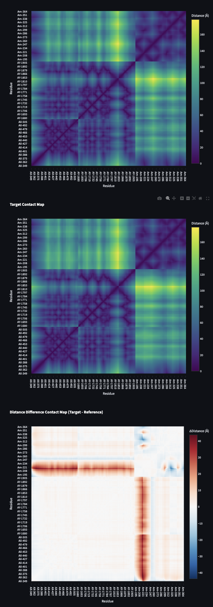

---

## 'The "Movement" Tab'

---

Calculate how each residue moves between two aligned conformations via calculting the distance between corresponding residues in the two structures, (with the ability for multiple comparisons coming soon).

Here, you must use aligned structures/models, but can choose any preffered method.

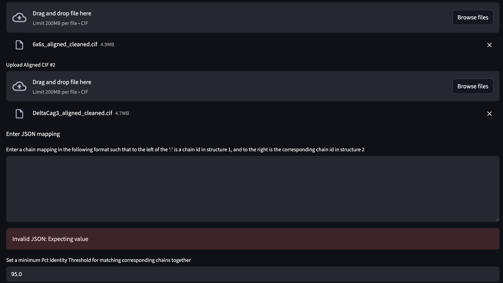

The Data Table will have the distance as well as the vector describing how each residue is moving between the two structures.
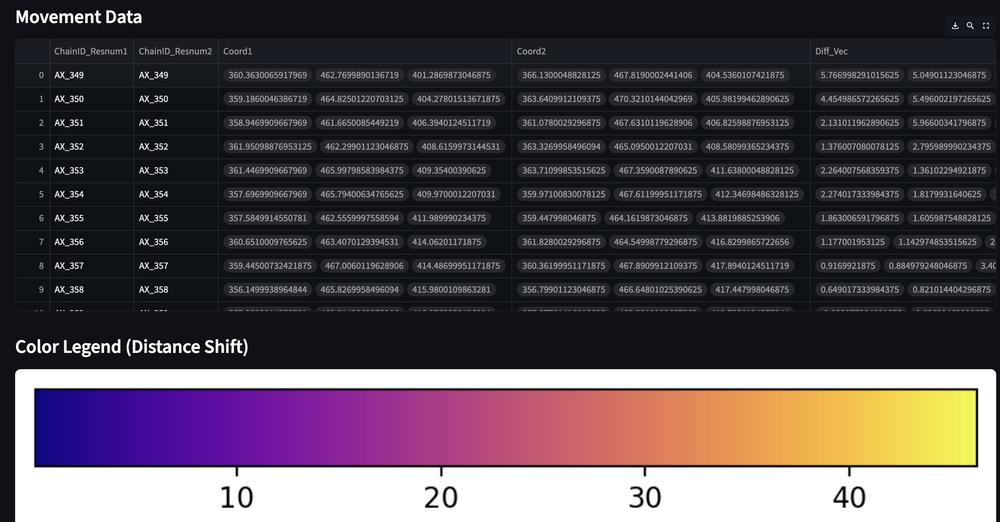

There will also be a color bar, which corresponds to the PyMol Viewer Preview Visualizations.
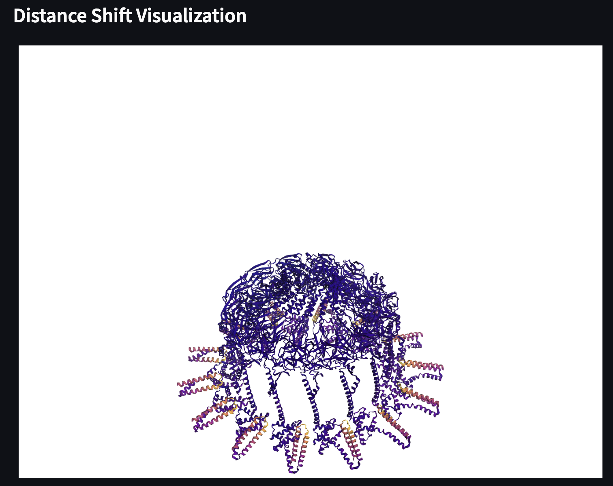

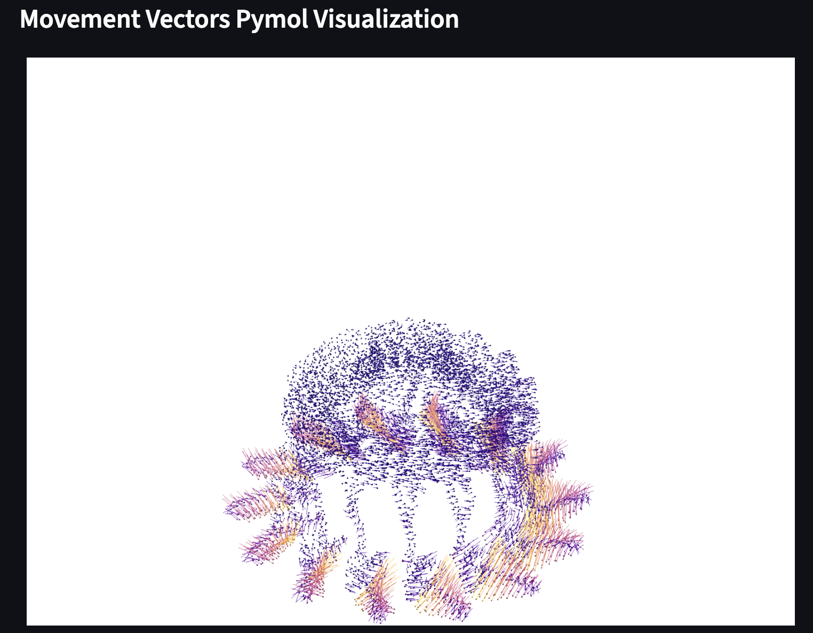

There will be an option to download a zipped folder containing these file contents.
- Opening the .cxc script calls the defattr files and will color in atoms into chimeraX, where you can then adjust as you see fit
- Opening the .bild file will put the vector representation into ChimeraX
- The csv contains all the associated data
- The cif files used for this comparison

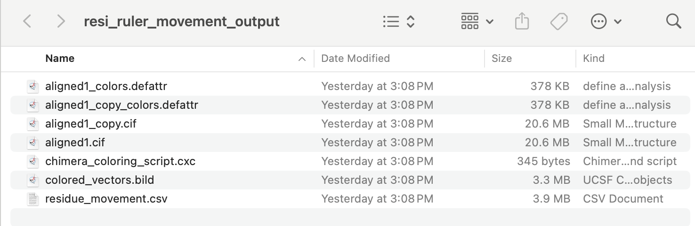

**Example Visualization**:


The coloring gradientcan be recolored inside of ChimeraX, by going to tools->depiction->Render/Select by Attribute

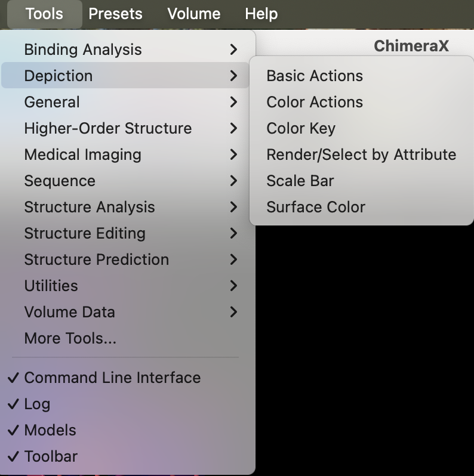

And then selecting the "distance" attribute in the window that pops up. This allow for thresholding as well as re-color by using different color palletes

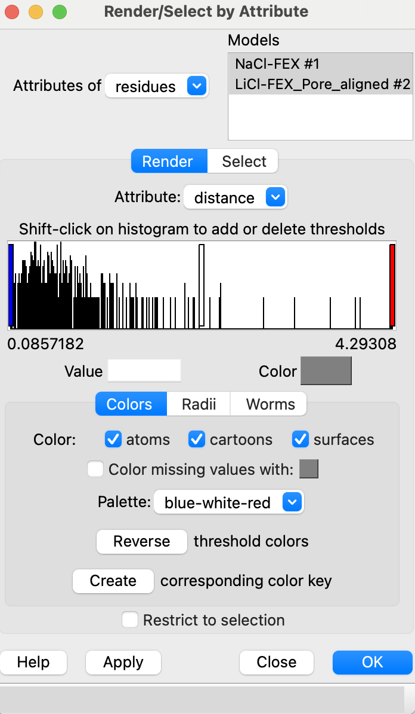

## Remote Access to Resiruler

Detailed instructions on opening jupyter notebook
Example port: 8888, example user: user
Change your port # 

Start interactive bash session

```bash
srun --partition=sb-gpu --nodes=1 --ntasks=1 --cpus-per-task=12 --mem-per-cpu=3g --gpus=2080ti:2 --time 4:00:00 --pty /bin/bash

```

Check which gpu you are using ex) gpucomp-01

```bash
Hostname
conda activate resiruler
cd path/Resiruler/ui/
streamlit run app.py
```
hostname = gpucomp-01

```bash
In new terminal window, forward port 8501
ssh -L 8501:localhost:8501 user@login.edu
ssh -N -L 8501:localhost:8501 gpucomp-01
```
Enter password -nothing else will happen in this terminal window
In web browser on local machine (your computer) enter link from Resiruler:
localhost:8501

---


## License

MIT License

---

## Author

Timothy Baker, Wilhelm Salmen
