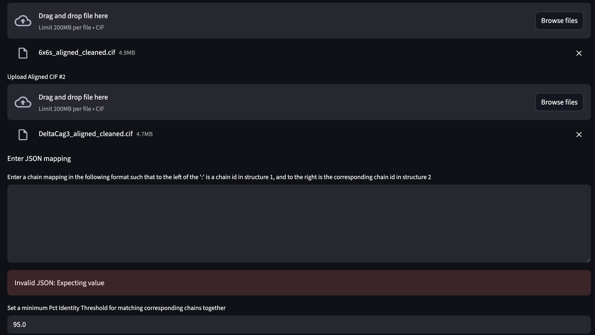
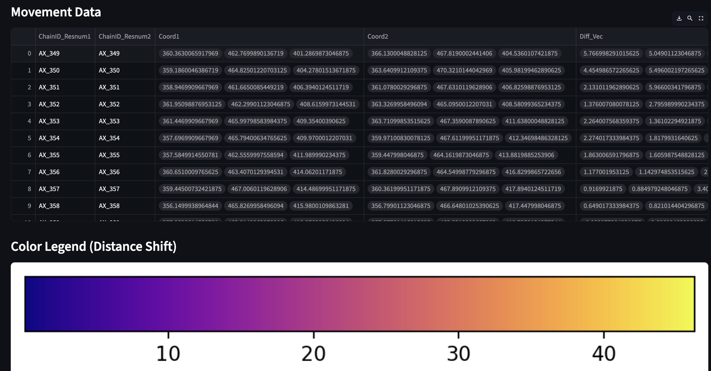
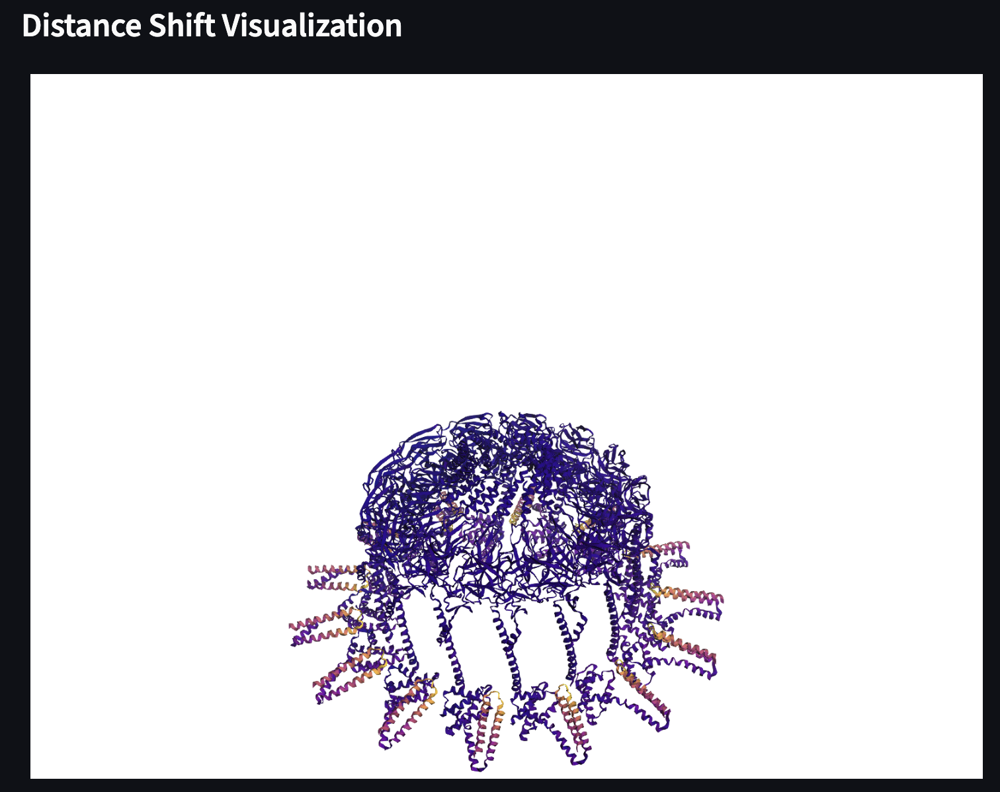
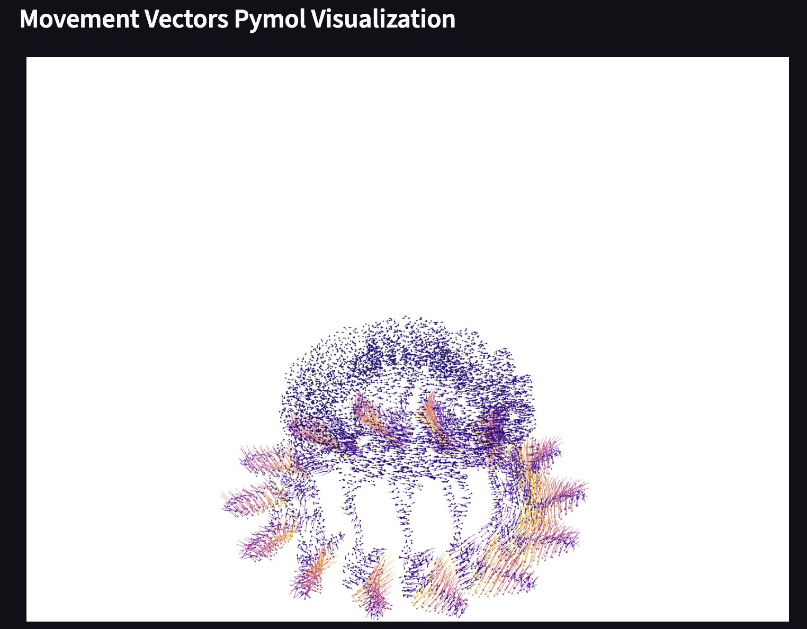
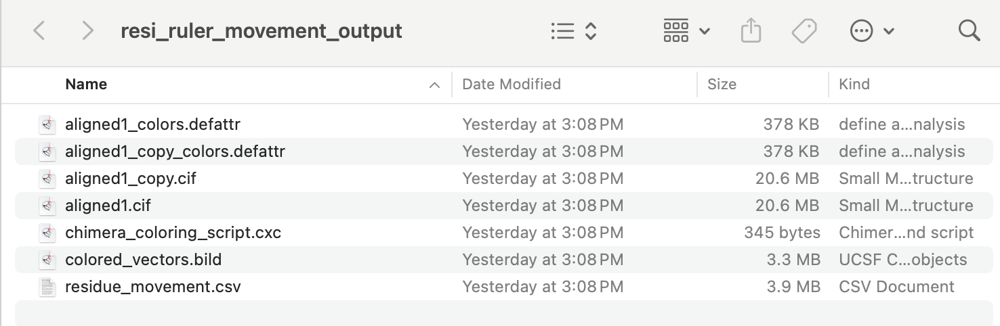

# ResiRuler

ResiRuler is a web interface based tool for analyzing and visualizing residue-level structural changes in biomolecular models. It supports measuring distances between annotated residues, comparing distances across aligned conformations, and visualizing movement vectors with options to visualize in ChimeraX

---

## Features

- Extracts and compares residue distances from `.cif` structures
- Computes movement vectors between aligned conformations
- Generates ChimeraX scripts for structural visualization
- Plots distance difference and residue displacement metrics as well as contact maps
- Aligns two models using the mmalign algorithm and cleans up non-matched residues

---

## Installation

Clone the repository and install the required dependencies:
ResiRuler dependencies are most easily downloaded using [conda](https://www.anaconda.com/docs/getting-started/getting-started)

Once conda is up and running here is how you can install resiruler as well as the associated dependencies

```bash
git clone https://github.com/tbaker67/ResiRuler.git
cd ResiRuler
conda env create -f environment.yml
conda activate resiruler
```
---

## Running the UI

ResiRuler's web interface is current managed through streamlit

First make sure to activate the conda environment
```bash
conda activate resiruler
```

Then use the streamlit command to launch the UI
```bash
streamlit run ResidueRuler/ui/app.py
```

A successful launch will provide this message in the terminal. Using the network url will allow others to access an independent instance of the Web Interface as long as they are connected to the same local network as the device the streamlit interface was launched from.


--- 

## The "Align" Tab

Align any two genetically similar molecules using [USalign's](https://www.nature.com/articles/s41592-022-01585-1) multimer alignment algorithm (MMalign). Use this tab before comparing or analyzing movement between structures.

Start by uploading files:


You can then select chains which you want the alignment program to consider when determining the best alignment.


Shows a preview of the alignment, which can be downloaded by pressing the button.


Optionally "clean" the alignment to remove unmatched chains or residues. 
The user is also provided with options for adjusting parameters associated with determining matched chains and residues


---

## The "Pairwise Distance Difference" Tab

Compare inter-residue distances between two structures.

- Auto-matches chains between structures, or allows explicit mapping.
- For best results, supply aligned structures from the **Align** tab or other alignment software.


Start by uploading the structure(s) of interest


Next, correspondence between chains in the reference and comparison/target structures can either be explicitly defined by the user.
Any chains that are not matched by the user, will enter the automatic chain mapping algorithm.


Distance thresholds for what actually gets displayed in the output can be specified by the user.


The user will then select the chains they would like to display in the plots, and a panel consisting of contact and distance difference maps as well as a table of the associated information will be displayed. All plots are fully interactive and can be made to fit the screen as well as be downloaded as their SVG image.


---

## The "Per-Residue Displacement" Tab


Calculate how each residue moves between two aligned conformations via calculting the distance between corresponding residues in the two structures.

Here, you must use aligned structures/models, but can choose any preffered method.



The Data Table will have the distance as well as the vector describing how each residue is moving between the two structures.


There will also be a color bar, which corresponds to the PyMol Viewer Preview Visualizations.




There will be an option to download a zipped folder containing these file contents.
- Opening the .cxc script calls the defattr files and will color in atoms into chimeraX, where you can then adjust as you see fit
- Opening the .bild file will put the vector representation into ChimeraX
- The csv contains all the associated data
- The cif files used for this comparison



**Example Visualization**:


The coloring gradient can be recolored inside of ChimeraX, by going to tools->depiction->Render/Select by Attribute


And then selecting the "distance" attribute in the window that pops up. This allow for thresholding as well as re-color by using different color palletes


## Remote Access to Resiruler on an HPC-Cluster

Example port: 8501, example user: user
Change your port # 

Start interactive bash session

```bash
srun --partition=sb-gpu --nodes=1 --ntasks=1 --cpus-per-task=12 --mem-per-cpu=3g --gpus=2080ti:2 --time 4:00:00 --pty /bin/bash

```

Check which gpu you are using ex) gpucomp-01

```bash
Hostname
conda activate resiruler
cd path/Resiruler/ui/
streamlit run app.py
```
hostname = gpucomp-01

In new terminal window, forward port 8501

```bash
ssh -L 8501:localhost:8501 user@login.edu
ssh -N -L 8501:localhost:8501 gpucomp-01
```
Enter password -nothing else will happen in this terminal window
In web browser on local machine (your computer) enter link from Resiruler:
localhost:8501

---


## License

MIT License

---

## Author

Timothy Baker, Wilhelm Salmen
