# ResiRuler

ResiRuler is a web interface based tool for analyzing residue-level structural changes both across biomolecular models. It supports alignment of structures using MMAlign, comparison of pairwise distances between residues, and visualization of displacements between corresponding residues across structures, which can be exported and viewed in ChimeraX and PyMol

---

## Requirements

- A Linux or MacOS operating system
- Python 3.11
- [Conda](https://www.anaconda.com/docs/getting-started/getting-started) Python package manager

---

## Installation

Clone the repository and install the required dependencies:

```bash
git clone https://github.com/tbaker67/ResiRuler.git
cd ResiRuler
conda env create -f environment.yml
conda activate resiruler
```
---

## Running the UI

ResiRuler's web interface is managed through streamlit

First make sure to activate the conda environment
```bash
conda activate resiruler
```

Then use the streamlit command to launch the UI
```bash
streamlit run ResidueRuler/ui/app.py
```

A successful launch will provide this message in the terminal. Using the network url will allow others to access an independent instance of the Web Interface as long as they are connected to the same local network as the device the streamlit interface was launched from.

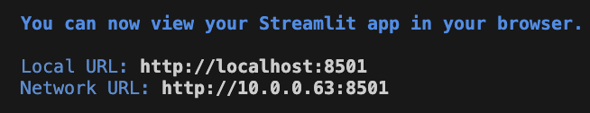

--- 

## The "Align" Tab

The Align Tab provides an easy way to align any two related similar structures using [USalign's](https://www.nature.com/articles/s41592-022-01585-1) multimer alignment algorithm (MMalign). Use this tab before comparing or analyzing movement between structures, or if you already have prealigned structures they can be used directly.

Start by uploading files:

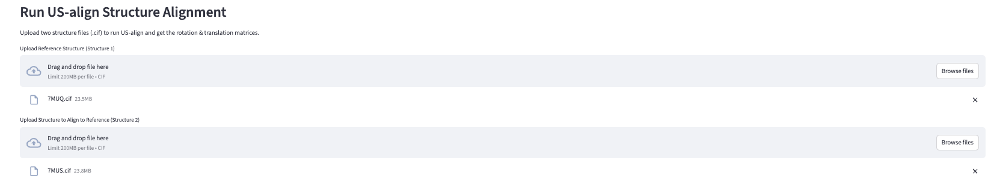

You can then select chains which you want the alignment program to consider when determining the best alignment.
Selecting less chains will result in a quicker alignment.

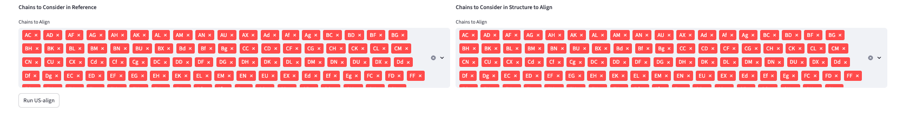

Shows a preview of the alignment, which can be downloaded by pressing the button.

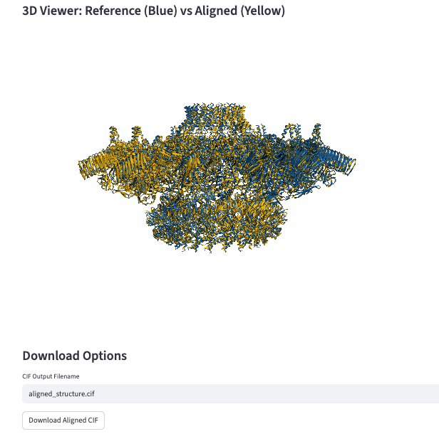


Optionally "clean" the alignment to remove unmatched chains or residues. 
The user is also provided with options for adjusting parameters associated with determining matched chains and residues


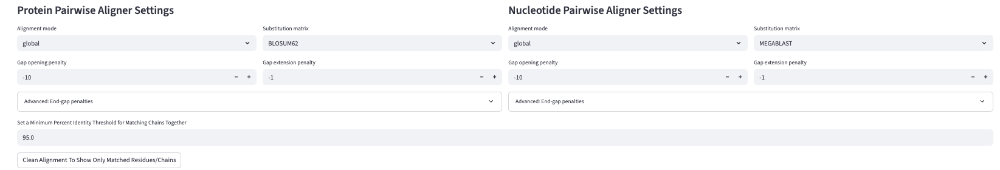

---

## The "Pairwise Distance Difference" Tab

The Pairwise Distance Difference Tab provides a view of how the distances between pairs of residues are changing across structures.
This can be represented both by raw distance changes, as well as changes in "contacts" based upon user specified thresholds

Start by uploading the ALIGNED structure(s) of interest. A single "reference" structure and as many "comparison" structures as they have.

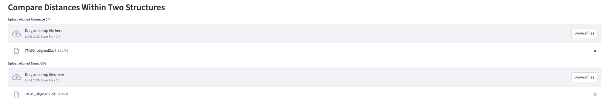


Next, correspondence between chains in the reference and comparison/target structures can either be explicitly defined by the user.
Any chains that are not matched by the user, will enter the automatic chain mapping algorithm. The UI offers users the ability to adjust 
the parameters for the automatic algorithm including settings for the sequence alignment, penalty for rmsd, and the minimum percent identity
needed for a valid match between two chains. Note that hovering over any of the question mark bubbles in the UI can give more explanation 
for some of these settings.

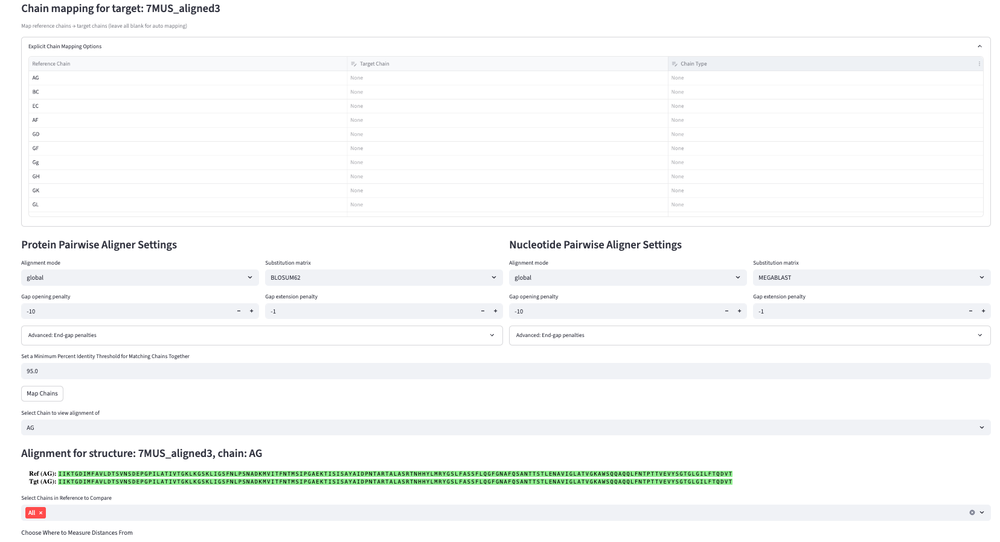

Distance thresholds for what actually gets displayed in the output can be specified by the user.


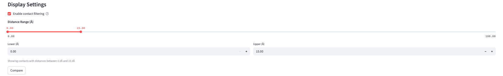

The user will then select the chains they would like to display in the plots, and a panel consisting of contact and distance difference maps as well as a table of the associated information will be displayed. All plots are fully interactive and can be made to fit the screen as well as be downloaded as their SVG image.
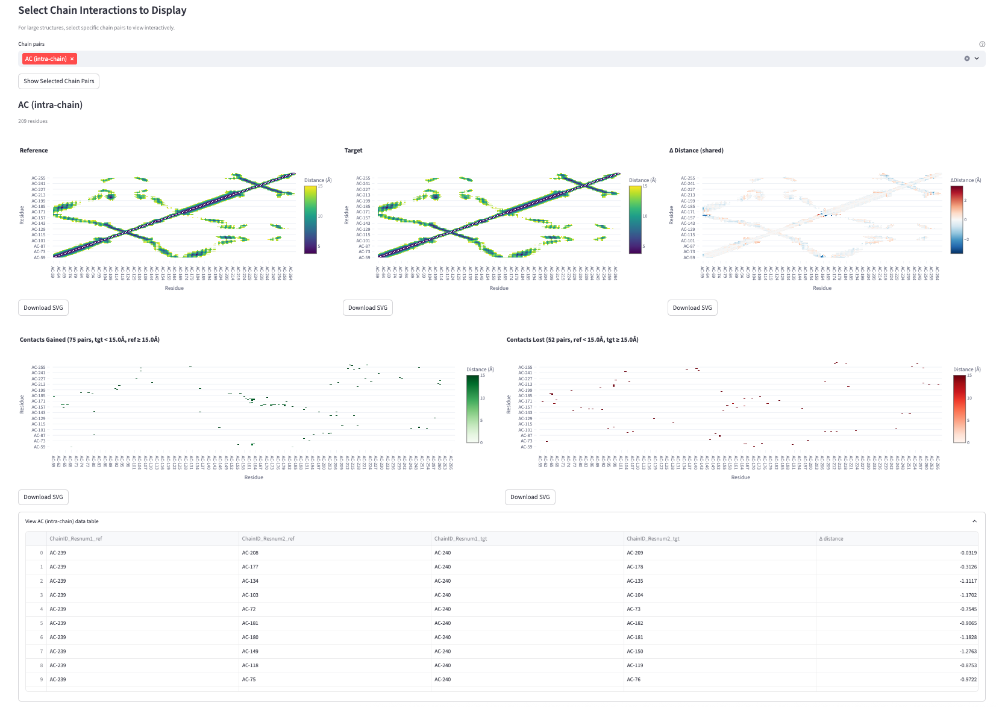

---

## The "Per-Residue Displacement" Tab

The Per-Residue Displacement Tab calculates displacement between residues in the reference their corresponding counterparts in the comparison structure to produce visualizations of the direction and magnitude of that displacement.

Similar to the Pairwise Distance Difference Tab, the user begin by uploading the reference structure and any number of comparison structures. They will also use a similar interface to specify chain correspondences if they would like to.


After alignment, the user can press the "Analyze Displacement" button to run the calculations, where they are then given the option to specify
a custom color scale to use for the visualizations in addition to a vector fidelity slider which is used to adjust how many displacement vectors
are shown.

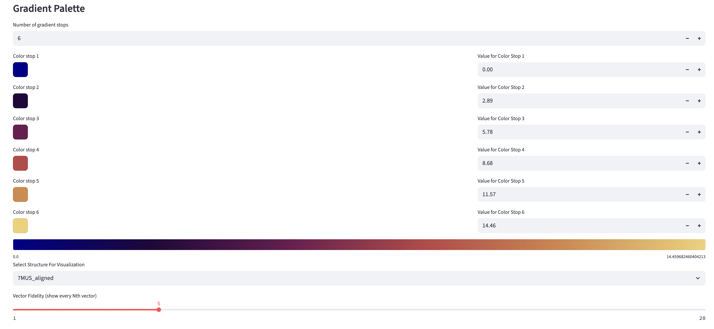

In app visualitions along with a table with all of the associated data will then be displayed for the user.

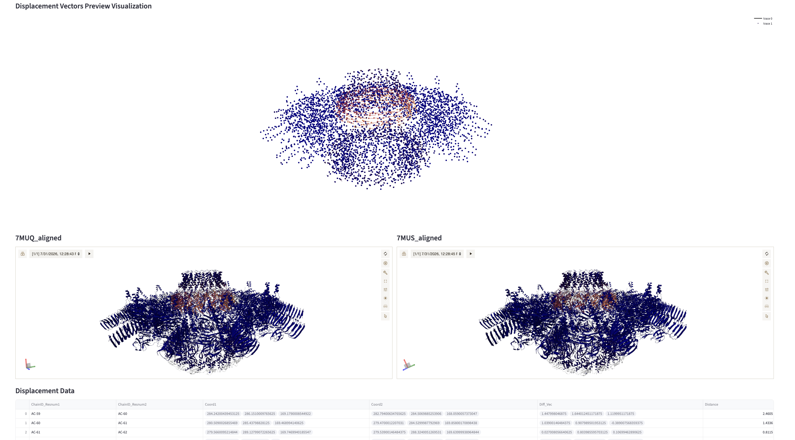

Finally, the user can download a zipped folder containing the data, visualization scripts, and models.

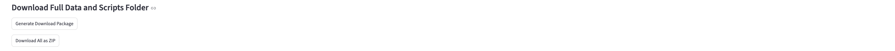
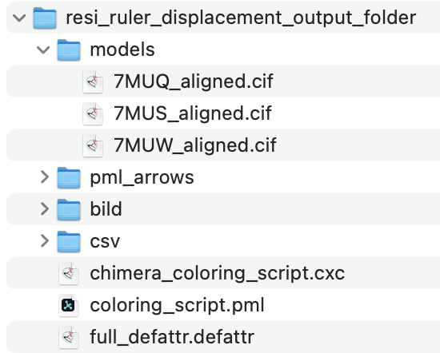

The `coloring_script.pml` and `chimera_coloring_script.cxc` will open and color all models for PyMol and ChimeraX respectively.
 - Models are named: {Model being shown}-{Model it was calculated against}

The `pml_arrows` and `bild` folders contain all of the arrows used for the displacement vector visualization and both will contain
a script `run_all_arrows.pml` and `open_all_bilds.cxc` to display all of the arrows 

**Example Visualization**:


The coloring gradient can be recolored inside of ChimeraX, by going to tools->depiction->Render/Select by Attribute

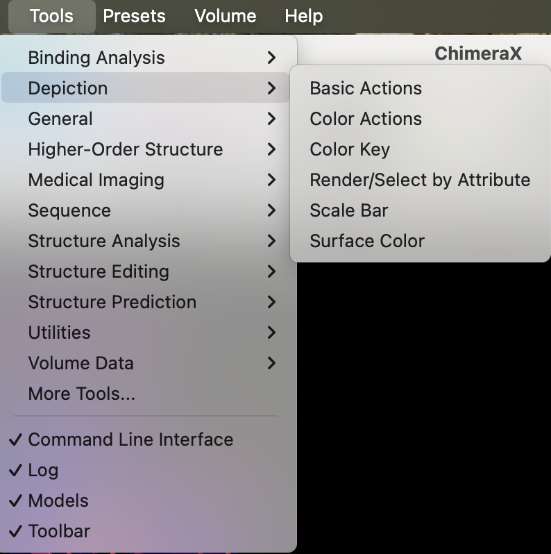

And then selecting the "distance" attribute in the window that pops up. This allow for thresholding as well as re-color by using different color palletes

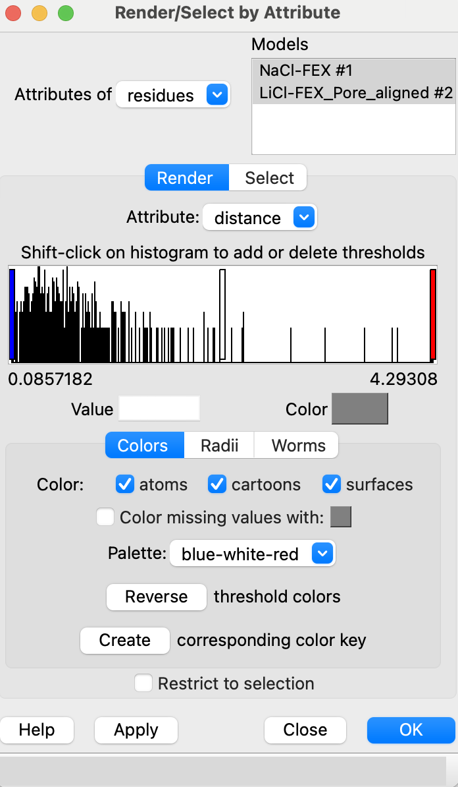

## Remote Access to Resiruler on an HPC-Cluster

Example port: 8501, example user: user
Change your port # 

Start interactive bash session

```bash
srun --partition=sb-gpu --nodes=1 --ntasks=1 --cpus-per-task=12 --mem-per-cpu=3g --gpus=2080ti:2 --time 4:00:00 --pty /bin/bash

```

Check which gpu you are using ex) gpucomp-01

```bash
Hostname
conda activate resiruler
cd path/Resiruler/ui/
streamlit run app.py
```
hostname = gpucomp-01

In new terminal window, forward port 8501

```bash
ssh -L 8501:localhost:8501 user@login.edu
ssh -N -L 8501:localhost:8501 gpucomp-01
```
Enter password -nothing else will happen in this terminal window
In web browser on local machine (your computer) enter link from Resiruler:
localhost:8501

---


## License

MIT License

---

## Author

Timothy Baker, Wilhelm Salmen
